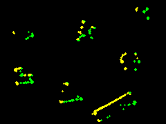

# blink-cam

An application for experimenting with event camera (DVS) event processing.

For an introduction to event cameras, see papers by
[Davide Scaramuzza et al](http://rpg.ifi.uzh.ch/research_dvs.html) 


# Dependencies

- Rust. Install [rustup](https://rustup.rs), which installs the required toolchain, including `cargo`.
- [ffmpeg](https://ffmpeg.org/download.html) if you'll create videos from the generated images using the provided scripts.

# Command line help

Get help on the command line using: `cargo run -- -h`

# Example usage

Starting with the `shapes_rotation` [data set](http://rpg.ifi.uzh.ch/datasets/davis/shapes_rotation.zip) 
provided by Scaramuzza et al, 
we first converted the `events.txt` file into a compact binary flatbuffer format using
[eventcam-converter](https://github.com/tstellanova/eventcam-converter)


### Process Events 
We then ran the tracker on this data set using the command line:

```
cargo run --release -- -i ./data/shapes_rotation_events.dat  --max_events=2000000  --rend_tracks --rend_sae --rend_corners
```

This limited the number of events processed to 2 million, 
caused the SAE, detected corners, and tracks to be rendered to image output files.

Sample images:
Surface of Active Events (SAE): 

Detected Corners: 

Tracks: 

### Create video 
We then collected the images into videos using:
```
./vid_sae_surface.sh ; ./vid_corners.sh ; ./vid_tracks.sh
```

- SAE surface video output example:
https://youtu.be/4DE-OBQyWFU

- Detected corners output example:
https://youtu.be/hZOEAUW3caA

- Tracks output example:
https://youtu.be/45kmVvHJ9UM
